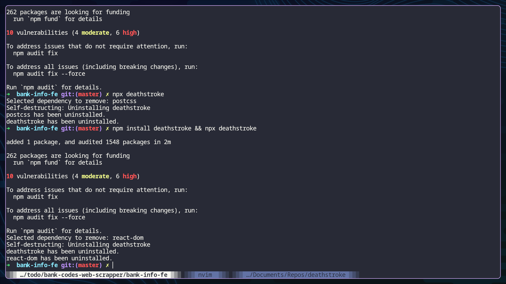

# Deathstroke

Just a simple idea. 



This is an npm package that destroys one of your project's package (like Russian roulette) at random then destroys itself

Even better, my package has a 50% chance of destroying itself.

Good Luck!

It is available through npm:

```
npm i deathstroke
```

To run it
```
npx deathstroke
```
